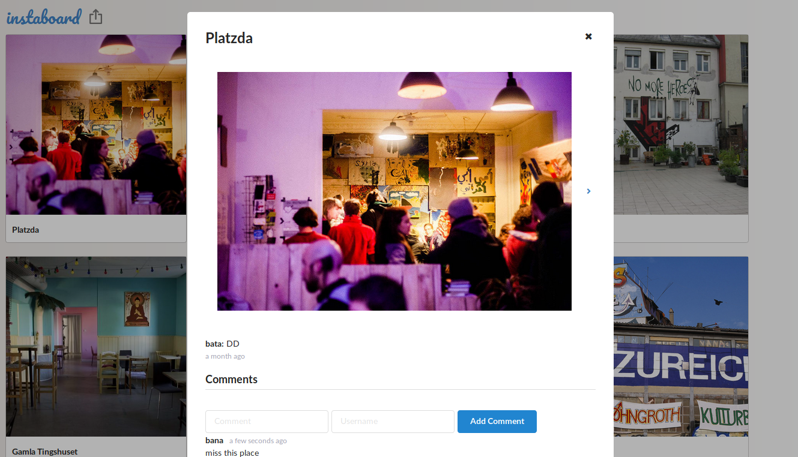

# Imageboard Website

Single-page application to post images and let others look at and comment on them.

## Features

- Predefined number of pictures on load, more on users request.
- Add image plus title, description and user name.
- Images are stored at Amazon S3.
- Enlarge photo in modal on click.
- Add comments.

## Technologies

HTML, CSS, JavaScript, Vue.js, Node.js, Express, PostgreSQL

## Development

- Edit PostgreSQL database parameters in [db.js](db.js).
- Run files in [sql](sql) to initialize tables in database.
- Configure Amazon S3 parameters in [s3.js](s3.js) and [config.json](config.json).
- Semantic UI.

```sh
npm install
node index.js
```

## Preview

### imageboard


### upload


### image modal


